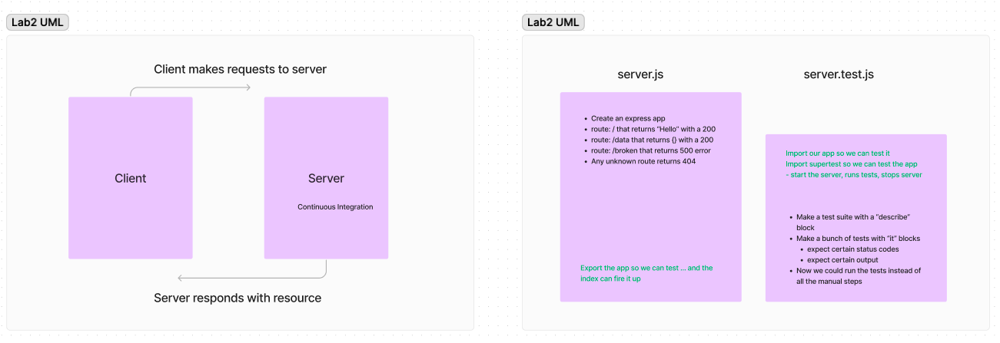

# Basic Express Server
This project is a simple Express server designed to demonstrate handling basic routing, middleware, and error management in a Node.js application. The server provides a `/person` endpoint that responds to GET requests with JSON data based on provided query parameters.

https://basic-express-server-mdaq.onrender.com

## Getting Started
### Prerequisites
- Node.js
- npm

### Installing
1. First, clone the repository to your local machine
2. Then, navigate to the project directory and install the required packages: `npm install`

### Running the Server
To start the server, run: `node index.js`

This will start the server on the port specified in your environment variables (.env file)

## Functionality
### Routes
`GET /`: Returns a simple "Hello World" message

`GET /person`: Fetches the name of a person from the query string and returns it in JSON format; if the name is not provided, it forces a 500 error

### Middleware
**Logger Middleware:** Logs every request showing the HTTP method and the path accessed

**Name Validator Middleware:** Checks for the presence of a `name` query parameter on requests to the `/person` route and ensures it is not empty

### Error Handling
**404 Not Found:** Any undefined routes will trigger a 404 error with a detailed message

**500 Server Error:** Handles scenarios where essential parameters are missing or an internal server malfunction, providing detailed diagnostics

## Testing
The tests are written using Jest and Supertest. They check the functionality of all routes, including error handling and middleware effectiveness.

To run the tests, execute: `npm test`

### Test Cases
- 404 for invalid URL: Checks if navigating to an undefined route returns a 404 status

- 500 if no name in the query string: Ensures that accessing `/person` without a name query parameter returns a 500 status

- 200 if the name is in the query string: Verifies that the `/person` route returns a 200 status and the correct name object when a valid name is provided

- Correct output object: Given a name in the query string, checks that the output object is correct, e.g., `{"name": "John"}`

## UML

